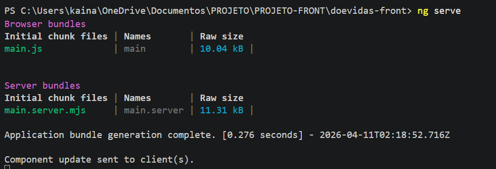
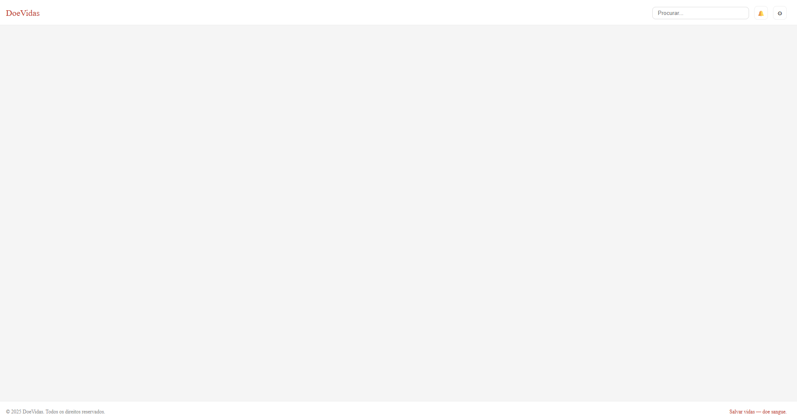
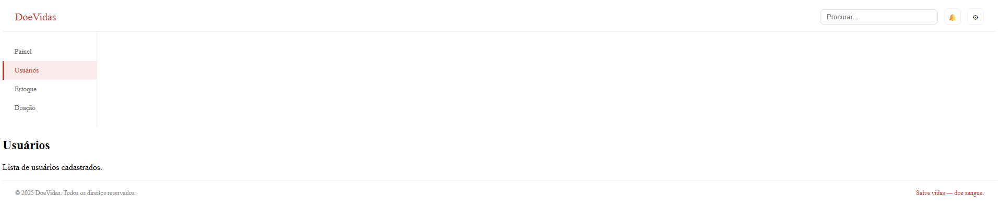
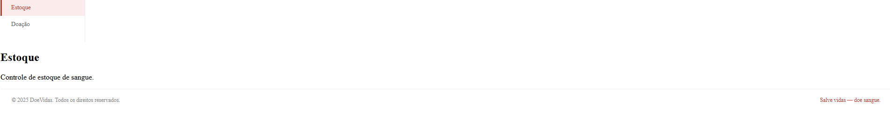
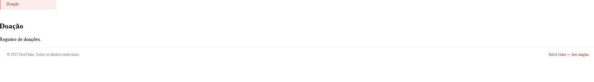

## Tabela de Mapeamento 26/03/2026

| Tela do Figma | Componentes Angular | Endpoint da API |
|------|--------|-----------|
| Usuarios | sangueComponent | /sangue
| Estoque   | estoqueComponent | /estoque|
| Doadores| doadoresComponent | /doadores|

## FIGMAN 

https://www.figma.com/design/ls8TsjR4Z3RidIIQZHDiZJ/Blood-Bank--Community-?node-id=2-2&t=lTvRxQPUn4W0Hp6E-1

## PRINTS ABAIXO

## TERMINAL 

## APLICAÇAO 

# PRINTS TESTE

# PRINT USUARIOS 

# PRINT ESTOQUE

 
 # PRINT DOAÇÃO 
 
